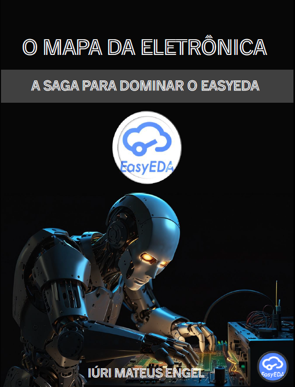

    

-------

# Projeto EBOOK Gerado por I.A.s

 > ℹ️ **NOTE:** Este é o repositório desenvolvido durante o curso no qual fui aluno técnico na plataforma da [DIO](https://dio.me)

Projeto com o objetivo de gerar um ebook digital com as facilidades das ferramentas de IA. todos os prompts
seguem abaixo.

<a href="https://github.com/felipeAguiarCode/prompts-recipe-to-create-a-ebook/blob/main/output/ebook%20-%20css%20jedi%20output.pdf" title="View PDF now"> 📕Clique aqui para ler</a>

## 💻 Tecnologias utilizadas no projeto

- [ChatGPT](https://chat.openai.com/) 
- [Leonardo AI](https://leonardo.ai)
- [PowerPoint](https://www.microsoft.com/en/microsoft-365/powerpoint)

## 🧠 Prompts

ChatGPT：

|   Ação   | prompt                                                                                                                                                                                                                                                                         |
| :------: | ------------------------------------------------------------------------------------------------------------------------------------------------------------------------------------------------------------------------------------------------------------------------------ |
|  título  | Crie um título de um ebook sobre o criação de layout no EASYEDA, o ebook é do nicho de engenharia e subnicho eletrônica, o título deve ser épico e curto, e tenha uma temática de aventura, me liste 5 variações de títulos                                                        |
| conteúdo | faça um texto para ebook, com foco em layout de circuito eletrônico, listando as principais ferramentas na utilização do EasyEDA {REGRAS} >Explique sempre de uma maneira simples >Deixe o texto enxuto >Sempre traga exemplos de como utilizar as ferramentas >Sempre crie um título sugestivo por tópico |

Leonardo AI：

|  Ação  | prompt                                                                                 |
| :----: | -------------------------------------------------------------------------------------- |
| título | robot creating an eletronic protoboard with black background |

## ✨ Features

- Conteúdo gerado via ChatGPT
- Imagens geradas via Leonardo AI

## 📚 Materiais

- Imagens utilizadas em `assets`
- ebook gerado durante as aulas em `output`

## 🛠️ Instruções de execução

Utilize os prompts acima nas ferramentas sugeridas para gerar o material base e utilize uma ferramenta de edição de documentos como power point, libreoffice , indesign para diagramação.

---

⌨️ com 💜 por [Felipe Aguiar](https://github.com/felipeAguiarCode)
